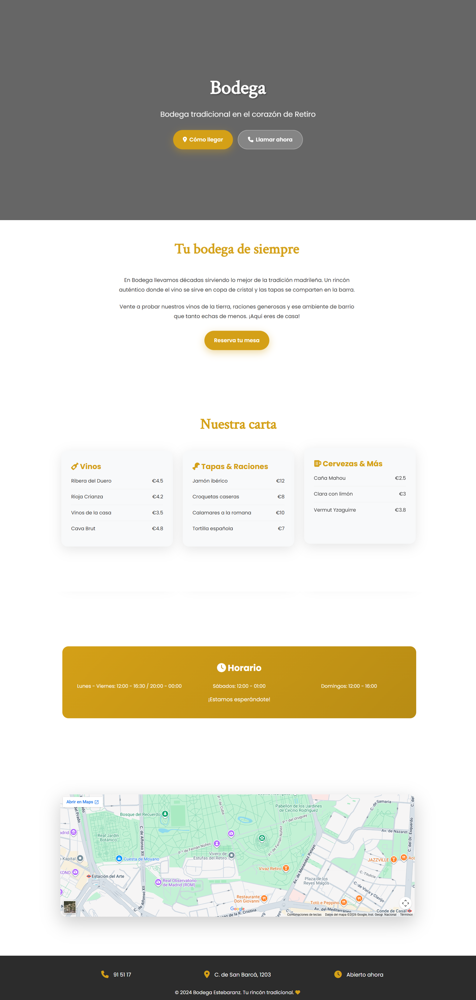

<<<<<<< HEAD
# prototipo-1 BÁSICO
 
Prototipo de página web para un negocio local.
=======
# 🌐 Prototipo 1

## 📖 Descripción

Prototipo básico de una página web desarrollado para practicar la estructura de un sitio web utilizando HTML.

Este proyecto representa uno de mis primeros desarrollos web y forma parte de una colección de prototipos creados para mejorar progresivamente mis habilidades en desarrollo Frontend.

---

## 🖼️ Vista previa

---

## 🚀 Tecnologías utilizadas

- HTML5
- CSS3

---

## ✨ Características

- Diseño sencillo y limpio
- Estructura semántica en HTML
- Información de un negocio local
- Secciones organizadas en una única página

---

## 📈 Evolución

Este proyecto pertenece a una serie de prototipos desarrollados para mejorar progresivamente mis conocimientos en desarrollo web.

Cada nuevo prototipo incorpora nuevas funcionalidades, una mejor organización del código y un diseño más elaborado.

---

## 👨‍💻 Autor

**Javier Cobo**

GitHub:
https://github.com/javiercobosanchez

Linkedin:
https://linkedin.com/in/javiercobosanchez
>>>>>>> 58b0ea4 (Initial commit)
